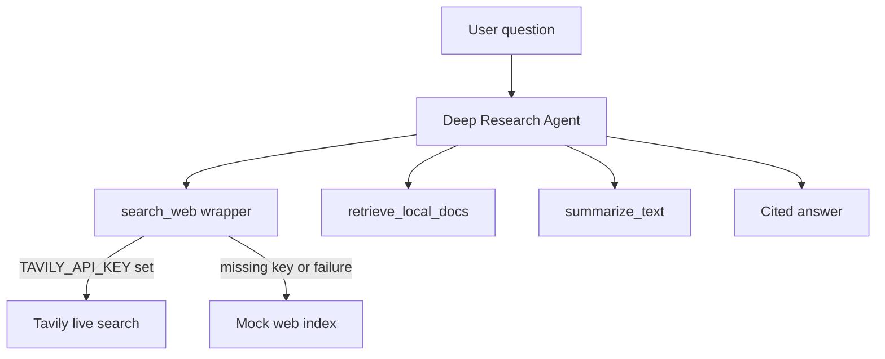

# Deep research agent with online search (Tavily)

## Goal
Upgrade the existing [`src/agents_research.py`](../src/agents_research.py:1) Deep Research Agent to support **real online search** via Tavily using `TAVILY_API_KEY`, while preserving the current deterministic mock search in [`src/tools_web_mock.py`](../src/tools_web_mock.py:1) as a **fallback**.

Constraints requested:
- Tavily results should return **URLs + titles + snippets only** (fast/cheap)
- Agent must **cite sources** and clearly separate `web:*` vs `local:*`

## Proposed tool API
### New tool: `search_web_live_tavily(query: str, max_results: int = 5) -> list[dict]`
File: [`src/tools_web_tavily.py`](../src/tools_web_tavily.py:1)

Return a list of dicts shaped to match the existing mock tool output (so downstream agent logic stays consistent):

```python
{
  "source_id": "web:tavily:<hash_or_rank>",
  "title": "...",
  "url": "...",
  "published": "",  # optional/empty if not provided
  "snippet": "..."
}
```

Notes:
- `source_id` must be stable within a single run and safe to cite.
- If Tavily provides a `published_date`, pass it through; otherwise blank.

### Wrapper tool: `search_web(query: str, max_results: int = 5) -> list[dict]`
File: [`src/tools_web.py`](../src/tools_web.py:1)

Behavior:
- If `TAVILY_API_KEY` is set and Tavily call succeeds: return Tavily results (with `web:tavily:*` ids)
- Else: fall back to [`src/tools_web_mock.py`](../src/tools_web_mock.py:99) returning `web:*` ids from the in-memory index

Error handling:
- Never throw hard exceptions to the agent if live search fails; instead return mock results and optionally attach a sentinel result like:
  - `web:warning_live_search_failed`

## Agent changes
File: [`src/agents_research.py`](../src/agents_research.py:1)

- Replace import of mock `search_web` with wrapper `search_web` from [`src/tools_web.py`](../src/tools_web.py:1)
- Update instructions:
  - Prefer live search when available
  - Still retrieve local docs
  - Cite both web and local sources
  - Clarify that web may be live when configured, otherwise mock fallback is used

## Dependencies
Option A (recommended): use the official Tavily python client.
- Add to [`requirements.txt`](../requirements.txt:1): `tavily-python` (exact package name to confirm during implementation)

Option B: use `httpx` to call Tavily REST endpoint.
- Add `httpx` to [`requirements.txt`](../requirements.txt:1)

## Demo changes
File: [`src/run_research_demo.py`](../src/run_research_demo.py:1)

- Keep prompt, but add a short preface print like:
  - `Using live Tavily search` vs `Using mock web search (no TAVILY_API_KEY)`
- Ensure debug output remains.

## Smoke test
Add [`src/run_web_search_smoke.py`](../src/run_web_search_smoke.py:1)
- Runs `search_web("test query")`
- Prints first result ids
- Exits non-zero if empty

## Mermaid (high-level)

